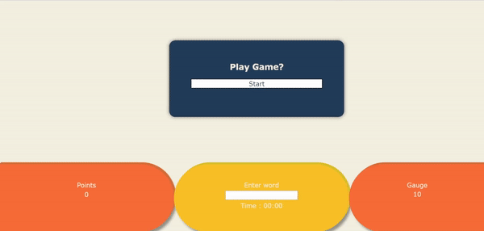

# Typing game

It is typing game that helps to improve your typing skills.

## Table of Contents

- [Technologies](#Technologies)
- [Link](#Link)
- [How to play](#How_to_play)
- [Screenshot](#screenshot)
- [Features](#Features)

## Technologies

- Javascripts
- CSS
- HTML

## Link

- Link to deployed typing game -> [typing game](https://typinggame-sunhee.netlify.app)

## How to play

- Go to the link above
- Start game by clicking "Start" button
- Type the letters which is one of words coming down into input form
- When it is correct, the word will be disappeared

## Screenshot

## Features

- Check if typed word is correct
- Display information on playtime, current score, the number of words missed while playing
- Speed up the dropping words over time while playing
- Display "final score" when game done

## Idea

1. elements for the game

- random words fall down to the ground
  - random words \*\*\*
  - boundary line of failure \*\*\*
  - display gauge to be done \*\*\*
  - display points \*\*\*
  - input to write down \*\*\*
  - start button \*\*\*

2. start with the game

- when player clicks startbutton, the game starts \*\*\*
  - Autofocus in textinput field \*\*\*
  - Random words are appeared in the screen -> counting time for how many words will be shown per second? \*\*\*
- player can write down one of the words falling into the inputfield \*\*\*
  - after writing the word, player clicks enter key -> event with enter key  
    -> this one has change to detect inputed letters without clicking something : easier to play game \*\*\*
  - the written word is checked if the word exsists \*\*\*
    - if the word written by the player is correct, the word is disapeared from the screen \*\*\*
      then player gets points of it & the inputfield will be empty \*\*\*
    - if the word is not correct, the word remains \*\*\*
- When words meet the bounday line of playing the game \*\*\*
  - the gauge will be lost as much as the number of words the player misses out \*\*\*

3. finish the game

- When the gauge will be empty, \*\*\*
  message including total points pop up \*\*\*

* if all features above are managed,
  - different levels depending on time or length of words/sentence \*\*\*
  - display rank of points
